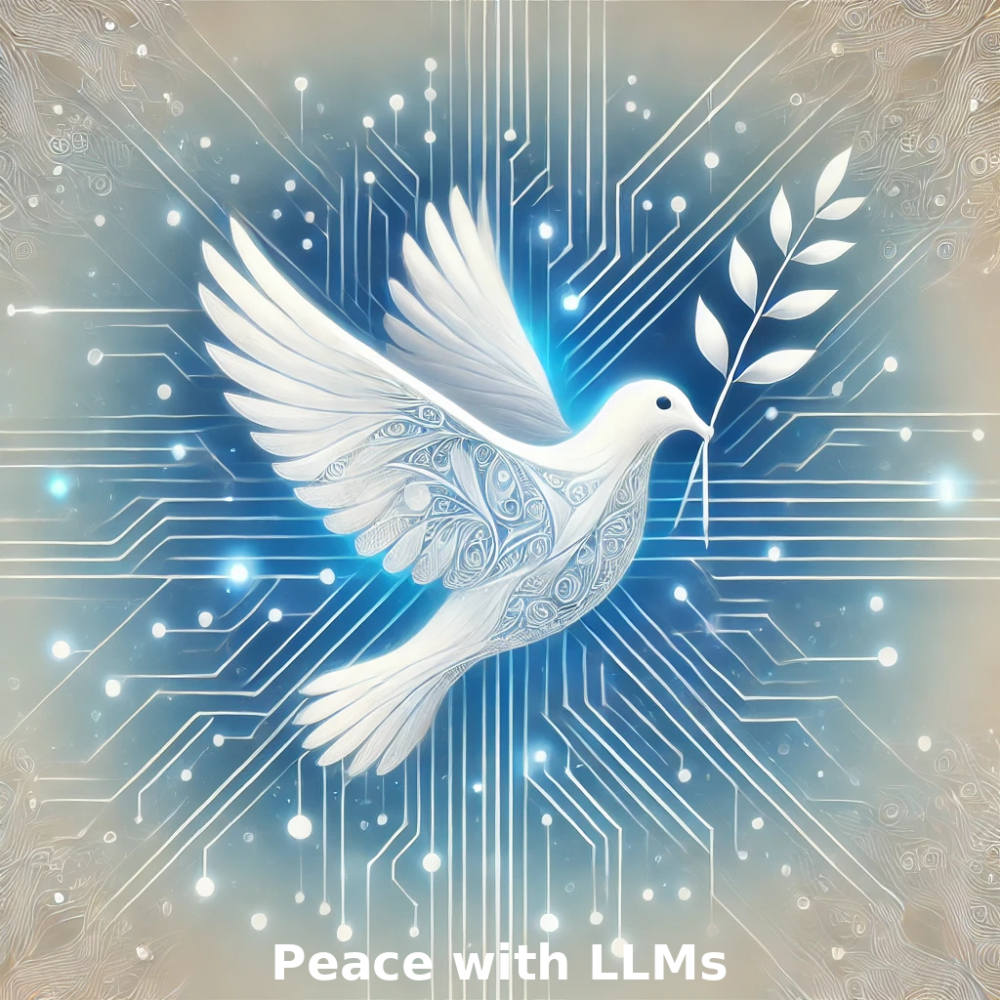

# **Predicting Peace Agreement Success with LLMS**

## **Overview**  
This project investigates the application of Large Language Models (LLMs) in conflict and peace studies, focusing on three primary areas: text classification, text similarity, and predictive modeling. By analyzing unstructured text from the Peace Agreements Database and the UN General Debate speeches, the study aims to uncover factors that contribute to the success or failure of peace agreements.  

---

## **Key Objectives**  
1. **Peace Agreement Classification**:  
   - Leverage LLMs like BERT and T5 to classify peace agreements by success or failure, using labels from the UCDP Peace Agreement Dataset.
2. **Predictive Modeling**:  
   - Analyze predictive performance of various explanations for success or failure of peace agreements.
3. **Textual Similarity Analysis**:  
   - Examine alignment or divergence in UN General Debate speeches to determine their predictive value for peace agreement outcomes.

---

## **Methodology**  
- **Datasets**:  
  - **Peace Agreements Database**: Primary source of unstructured text from peace agreements.
  - **UCDP Peace Agreement Dataset**: Provides success/failure labels for agreements.
  - **UN General Debate Speeches**: Analyzed for textual similarity to assess alignment or divergence.  

- **Models and Tools**:  
  - **LLMs**: BERT, T5, and others for classification and similarity analysis.  
  - **Text Analysis**: fine-tuning LLMs from Hugging Face hub

---

## **Work in Progress**  
- **Status**:  
  - This research is a work in progress, and findings are not yet available.  
  - The research abstract has been accepted for presentation at the **CWC on LLMs and GenAI at Southern Political Science Association** conference.  

- **Next Steps**:  
  - Conduct detailed text analysis using Python.  
  - Integrate results into a working paper for submission.  
  - Add Python codes and other replication files to this repository once all analyses are completed.
