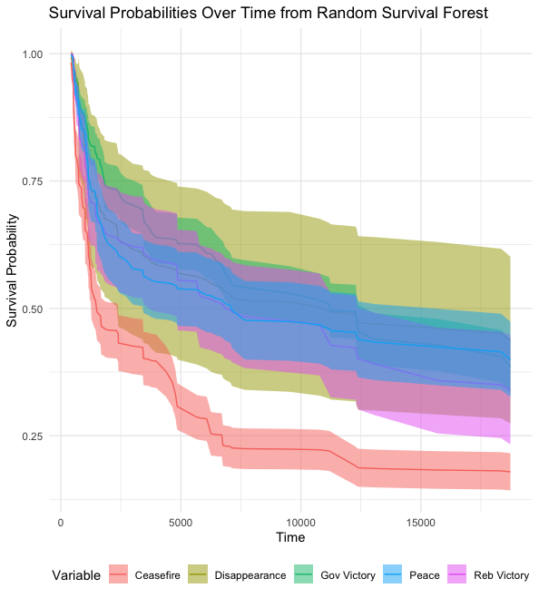

# **A Global Analysis of War Recurrence**

## **Overview**  
More than half of all civil wars that ended between 1945 and 2022 later resumed. Expanding on previous research, this study theorizes, disaggregates, and assesses how the nature of war termination shapes the likelihood that conflicts will recur. Using matching, Inverse Propensity Weighting(IPW), and entropy balancing,  It finds that wars are more likely to repeat after ceasefires than after peace agreements and military victories.  This project investigates the mechanisms that render ceasefires more likely to reignite wars relative to other outcomes: rearmament, alliance formation, and nation-state building.

---

## **Key Contributions**  
1. **Theoretical Advancement**:  
   - Proposes and tests mechanisms linking war termination outcomes to conflict recurrence with causal identification techniques   
2. **Empirical Insights**:  
   - Analyzes global data on civil war terminations and recurrences from 1945–2022 using Cox models and Random Survival Forests and integrating NHST with prediction
3. **Policy Implications**:
   - calls policymakers and conflict resolution mediators to be caution about ceasefires and making sure that it leads to peace agreement . 
---

## **Methodology**  
- **Quantitative Analysis**:  
  - Global dataset covering civil war terminations and recurrences since World War II.  
  - Cox proportional hazards models and Random Survival Forests to assess influence of war termination types.  
- **Qualitative Case Study**:  
  - Original interviews and contextual analysis of Nagorno-Karabakh conflict to examine mechanisms like rearmament, alliance formation, and nation-state building.  

---

## **Findings**  
1. Ceasefires significantly increase likelihood of conflict recurrence compared to peace agreements or military victories.  
2. Mechanisms such as rearmament and alliance formation during ceasefires prolong hostilities and intensify conflicts.  
3. Findings challenge assumption that ceasefires inherently promote peace, suggesting instead that they may inadvertently set the stage for future conflict.  

---

## **Implications**  
This research provides the following actionable insights for policymakers and conflict management practitioners:  
1. Ceasefires should be accompanied by mechanisms to monitor rearmament and alliance activities.  
2. International actors must prioritize comprehensive peace agreements over temporary ceasefires to reduce likelihood of recurrence.  

---
