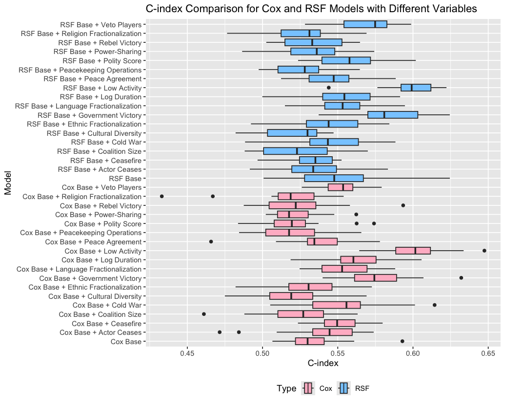

# **Predicting Civil War Recurrence with Survival-Based Machine Learning**

## **Overview**  
This project explores the use of survival-based machine learning algorithms to predict civil war recurrence, addressing shortcomings in traditional approaches such as the Cox proportional hazards model. While the null hypothesis significance testing (NHST) approach has been instrumental in theoretical advancements, it lacks predictive capabilities and is prone to overfitting due to the absence of data partitioning.  

To overcome these limitations, this study evaluates five groups of machine learning algorithms specialized for survival analysis. The goal is to forecast civil war recurrence, adapting machine learning models tailored for survival analysis traditionally used in medical research, for conflict studies.

---

## **Key Contributions**  
1. **Predictive Modeling**:
   - substantive: predicting civil war recurrence 
   - methodological: development of machine learning models tailored for survival analysis of civil war recurrence and conflict studies overall.
---

## **Methods and Algorithms**  
### **Benchmark Models**  
- **Standard Cox Proportional Hazards**:
  - A foundational model for survival analysis (Cox, 1972).

### **Machine Learning Approaches**  
#### **Penalized Cox Regression**  
1. **Lasso**: Variable selection and shrinkage for high-dimensional data (Tibshirani, 1997).  
2. **Ridge**: Reduces prediction error in multicollinearity scenarios (Verweij & Van Houwelingen, 1994).  
3. **Elastic Net**: Balances variable selection and shrinkage (Simon et al., 2011).  

#### **Random Survival Forests (RSF)**  
- Non-linear effects and interactions with variable importance measures (Ishwaran et al., 2008).  
- Adaptations like **Maximally Selected Rank Statistics RSF** target optimal splits for improved accuracy.

#### **Boosting Algorithms**  
1. **CoxBoost**: Sparse model selection with component-wise boosting (Binder & Schumacher, 2008).  
2. **GLMBoost**: Handles high-dimensional spaces with additive risk models (Tutz & Binder, 2006).  
3. **XGBoost**: Scalability and efficiency in large datasets (Chen & Guestrin, 2016).

#### **Survival SVM**  
- A margin-based approach for censored survival data (Van Belle et al., 2011).  

#### **Neural Network Models**  
1. **Cox-nnet**: Captures complex non-linear relationships (Ching et al., 2018; Wang et al., 2021).  
2. **N-MTLR (Neural Multi-Task Logistic Regression)**: Direct modeling of survival distributions (Fotso, 2018).

---

## **Key Tasks and Steps**  
1. Establish a baseline model with population and GDP predictors.
2. Incrementally add variables from civil war recurrence literature.
3. Evaluate model performance using the concordance index (C-index).
4. Explore Time-dependent AUC
5. Also obtain variable importance from RSF

---
