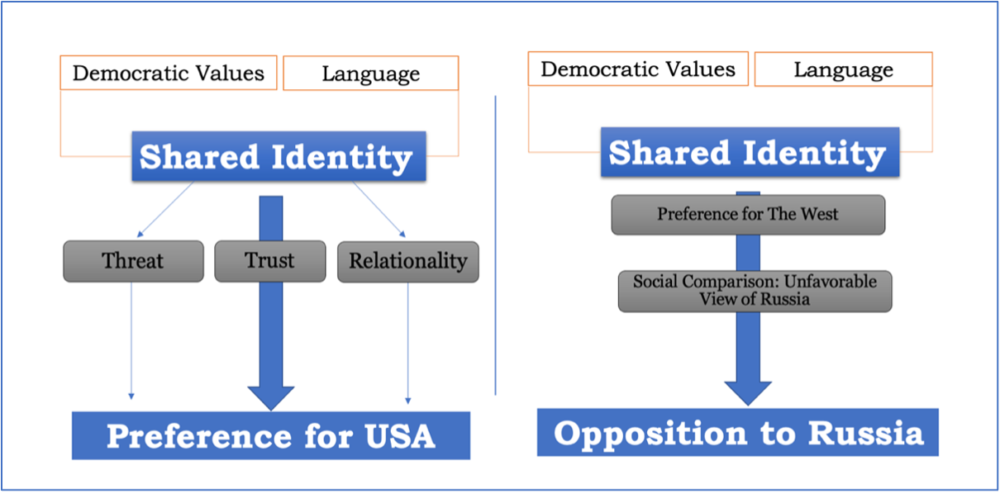
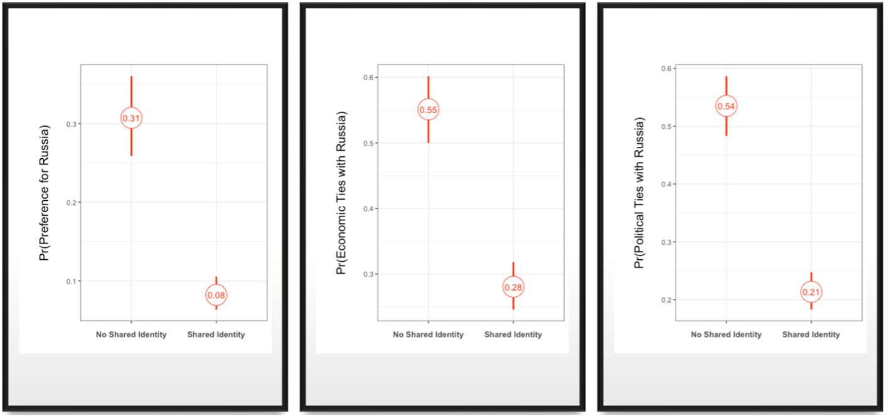

# Identity Matters: Role of Shared Identities in Foreign Policy Dispositions within Small States towards Great Powers

## Summary

This repository accompanies the research paper **"Identity Matters: Role of Shared Identities in Foreign Policy Dispositions within Small States towards Great Powers"**. The study explores how shared identities influence foreign policy dispositions in small states towards great powers like the United States and Russia. 

Small states, characterized by limited capabilities and a focus on survival and security, are often objects of great power competition in the post-Cold War era. While previous research has emphasized great power strategies, this study focuses on individual foreign policy preferences in small states.

The key argument is that shared identity—based on collective identification with the West—plays a critical role in shaping attitudes toward great powers. Citizens who perceive a shared identity with the West are more likely to:

- Support closer political and economic ties with the United States.
- Disapprove of alignment with Russia, which they perceive as an out-group.

Using machine learning models, the study demonstrates that identity-based explanations have higher predictive power than instrumental rationality or materialist factors in forecasting foreign policy preferences.

---

## Key Findings

1. **Shared Identity and Preferences for the United States**:
   - Citizens who perceive a shared identity with the West view the United States as trustworthy and less threatening.
   - They are more likely to support closer ties with the United States in terms of political, economic, and cultural relations.

2. **Shared Identity and Opposition to Russia**:
   - Individuals with a Western identity perceive Russia as an out-group, leading to unfavorable opinions and reduced support for alignment.

3. **Machine Learning Insights**:
   - Models based on shared identity outperformed those focusing on instrumental rationality or materialist explanations in predicting foreign policy preferences.
   - This stresses out the importance of psychological and relational factors in understanding great power competition.

---

## Implications

- **Policy**: Understanding shared identity dynamics can help great powers develop more effective foreign policy strategies towards small states.
- **Security**: Identity-driven preferences have significant implications for international and regional security in the context of great power competition.
- **Future Research**: The findings encourage further exploration of identity-based mechanisms in other geopolitical contexts.
